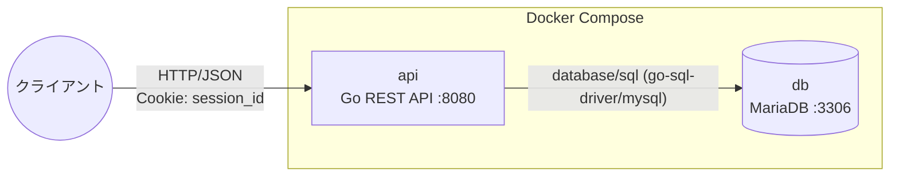
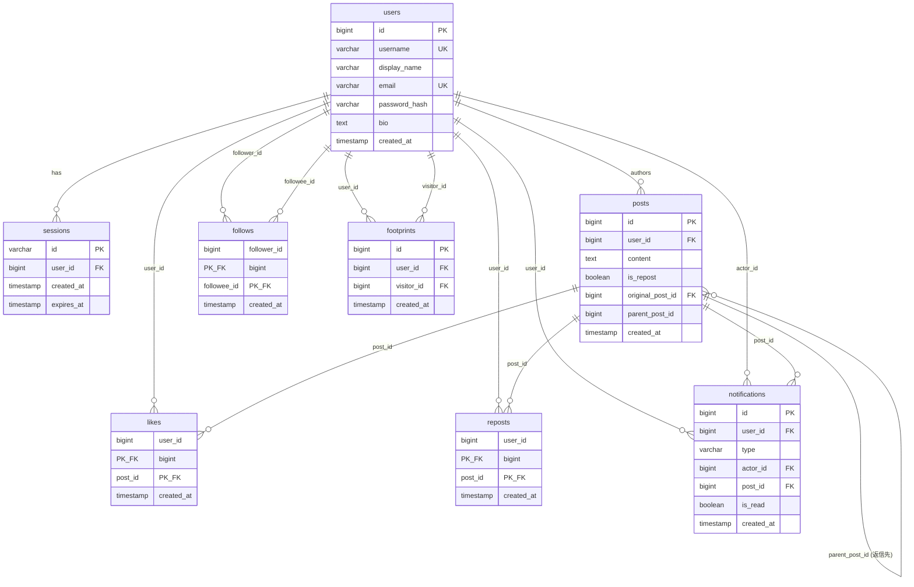
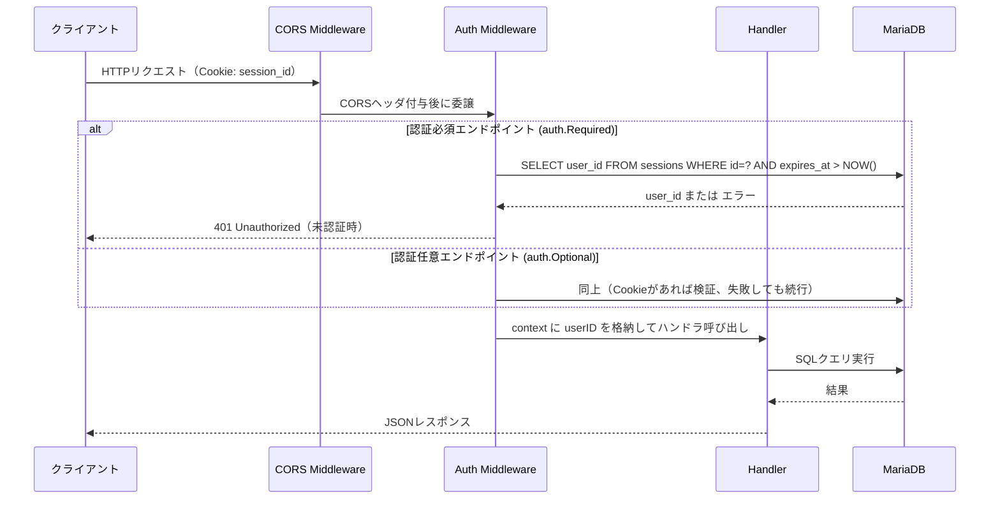

# Sakuravel 構成説明資料

このドキュメントは、「Sakuravel」の全体構成を理解するためのリファレンスです。
アプリケーションの目的・技術スタック・ディレクトリ構成・データモデル・API・開発環境の起動方法をまとめています。

## アプリケーション概要

Sakuravel は、Twitter/X ライクな短文投稿 SNS（マイクロブログ）です。ユーザーは短文投稿（最大140文字）の作成・閲覧、他ユーザーのフォロー、投稿への「いいね」「リポスト」、キーワード検索、通知の受信、プロフィール訪問履歴（足跡）の確認、トレンド投稿の閲覧ができます。

### 主な機能

| 機能 | 概要 |
|---|---|
| 認証 | メールアドレス・パスワードによる登録／ログイン／ログアウト（セッションクッキー方式） |
| 投稿 | 短文投稿の作成・閲覧・削除、フォロー中ユーザーのタイムライン表示 |
| フォロー | ユーザーのフォロー／フォロー解除、フォロワー・フォロー中一覧 |
| いいね | 投稿への「いいね」／解除、いいねしたユーザー一覧 |
| リポスト | 投稿の再共有／取り消し |
| 返信（スレッド） | 投稿への返信。返信にさらに返信でき、ツリー状のスレッドになる |
| 検索 | 投稿本文・ユーザー名・表示名によるキーワード検索 |
| 通知 | フォロー・いいね・リポスト・返信・足跡（プロフィール訪問）の通知一覧、未読件数、既読化。種別タブで絞り込み可 |
| リアルタイム配信 | SSE（Server-Sent Events）で通知バッジと開いているスレッドを自動更新 |
| 足跡 | プロフィール訪問履歴の記録・集計・一覧表示 |
| トレンド | 直近1時間のいいね数上位の投稿ランキング |

## 技術スタック

**バックエンド**
- Go 1.25 / 標準ライブラリ `net/http`
- MariaDB 10.11
- Cookie ベースのセッション認証（`sessions` テーブルで管理）

**インフラ**
- Docker / Docker Compose

## ディレクトリ構成

```
 backend/                Go 製 REST API
 ├── docs/               設計資料・要件定義など
 ├── cmd/api/            エントリポイント（main.go, ルーティング定義）
 ├── internal/
 │   ├── db/             DB接続初期化
 │   ├── handler/        エンドポイントごとのハンドラ実装
 │   ├── middleware/     認証ミドルウェア（セッション検証）
 │   ├── realtime/       SSE の購読管理（通知・スレッド）
 │   └── model/          User / Post / Notification などのデータモデル
 ├── migrations/         スキーマ定義（db コンテナの初回起動時に自動実行）
 ├── seed/               動作確認用のダミーデータ投入スクリプト
 ├── Dockerfile          API のイメージ定義
 ├── .env.example        環境変数のサンプル
 ├── docker-compose.yml  アプリケーションの起動定義
 └── compose.reg.yml     コンテナレジストリを利用したアプリケーションの起動定義

```

## システム構成図（開発環境）



- 認証は Cookie（`session_id`）ベースです。ログイン成功時に発行された `session_id` を `Cookie` ヘッダーで送信することで認証済みリクエストとして扱われます。
- `db` コンテナの初回起動時のみ `migrations/*.sql` が MariaDB の初期化フックで自動実行され、スキーマが作成されます（既にデータボリュームがある場合は実行されません）。

## データベース設計（ER図）



補足:
- `posts.content` は `NULL` かつ `is_repost = true` の場合があります。これはリポストが「元投稿とは別の行」として `posts` テーブルに作成される仕様のためです（`original_post_id` で元投稿を参照）。
- `follows` / `likes` / `reposts` は複合主キー（`user_id, post_id` など）により重複登録を防止しています。
- `notifications.type` は `like` / `follow` / `repost` / `reply` / `footprint` のいずれかです。
- 返信もリポストと同様に「`posts` テーブルの別の行」として作成されます（`parent_post_id` で返信先を参照）。`parent_post_id` が `NULL` なら通常の投稿です。

## バックエンドのリクエスト処理フロー



- ルーティングは `backend/cmd/api/main.go` の `routes()` で一括定義されています。エンドポイントごとに `auth.Required`（未認証は401）／`auth.Optional`（未認証でも通すが認証済みならユーザー情報を付与）を使い分けています。
- 例: `GET /profile/{user_id}` は認証任意です。認証済みユーザーが他人のプロフィールを閲覧すると、足跡記録と通知作成が同時に行われます。

## API エンドポイント一覧

詳細な仕様（リクエスト・レスポンス例）は [API仕様](./docs/api.md) を参照してください。ここでは全体像のみ示します。

| カテゴリ | メソッド・パス | 概要 | 認証 |
|---|---|---|---|
| 認証 | `POST /register` | ユーザー登録 | 不要 |
| | `POST /login` | ログイン | 不要 |
| | `POST /logout` | ログアウト | 要 |
| | `GET /me` | 自分の情報取得 | 要 |
| ユーザー | `GET /profile/{user_id}` | プロフィール取得 | 任意 |
| | `PUT /profile` | プロフィール更新 | 要 |
| | `GET /users/{user_id}/followers` | フォロワー一覧 | 任意 |
| | `GET /users/{user_id}/following` | フォロー中一覧 | 任意 |
| | `POST /users/{user_id}/follow` | フォロー | 要 |
| | `DELETE /users/{user_id}/follow` | フォロー解除 | 要 |
| 投稿 | `GET /posts` | タイムライン取得 | 要 |
| | `POST /posts` | 投稿作成 | 要 |
| | `GET /posts/{id}` | 投稿取得 | 任意 |
| | `DELETE /posts/{id}` | 投稿削除 | 要 |
| | `GET /users/{user_id}/posts` | ユーザーの投稿一覧（`type=posts`/`replies`） | 任意 |
| 返信（スレッド） | `POST /replies` | 返信作成 | 要 |
| | `GET /posts/{id}/thread` | スレッド取得（祖先＋対象＋返信ツリー） | 任意 |
| | `GET /posts/{id}/thread/stream` | スレッドへの新規返信を SSE 配信 | 任意 |
| いいね | `GET /posts/{id}/likes` | いいねしたユーザー一覧 | 不要 |
| | `POST /likes` | いいね | 要 |
| | `DELETE /likes/{post_id}` | いいね解除 | 要 |
| リポスト | `POST /reposts` | リポスト | 要 |
| | `DELETE /reposts/{post_id}` | リポスト解除 | 要 |
| 検索 | `GET /search` | 投稿・ユーザー検索 | 不要 |
| 通知 | `GET /notifications` | 通知一覧 | 要 |
| | `POST /notifications/read` | 既読化 | 要 |
| | `GET /notifications/unread_count` | 未読件数 | 要 |
| | `GET /notifications/stream` | 通知を SSE 配信 | 要 |
| 足跡 | `GET /me/footprints` | プロフィール訪問者一覧 | 要 |
| トレンド | `GET /trending` | トレンド投稿 | 任意 |

## バックエンドの起動方法

```bash
cd backend
docker compose up -d
```

- フロントエンド: `http://localhost:3000`（ビルド済みイメージを取得して起動します）
- API: `http://localhost:8080`
- MariaDB: `localhost:3306`（DB: `sakuravel` / user: `sakuravel` / password: `password`）

初回起動時のみ `migrations/*.sql` が自動実行され、スキーマが作成されます。

### コンテナの操作

以下のコマンドは `backend` ディレクトリで実行します。

| 目的 | コマンド |
|---|---|
| バックグラウンド起動 | `docker compose up -d` |
| コンテナ停止（削除はしない） | `docker compose stop` |
| コンテナ再起動（イメージの再ビルドはしない） | `docker compose restart` |
| コンテナ停止＋削除（DBのデータはボリュームに残る） | `docker compose down` |
| ログを追いかける | `docker compose logs -f`（個別なら `docker compose logs -f api`） |

### ダミーデータの投入

ダミーデータの投入手順（データのリセット方法や投入量の変更方法を含む）は [ダミーデータの投入手順](./docs/説明資料/ダミーデータの投入手順.md) を参照してください。

### 性能改善前後の比較

コンテナレジストリのタグ（`baseline` / `optimized`）で api コンテナだけを
差し替え、モニタリングスイート上でエンドポイント応答時間を比較できます。

```bash
./scripts/switch-variant.sh baseline     # 改善前のアプリに切り替え
./scripts/switch-variant.sh optimized    # 改善後のアプリに切り替え
```

イメージの焼き方や比較の見方は [性能改善前後の比較手順](./docs/perf-compare.md) を参照してください。
